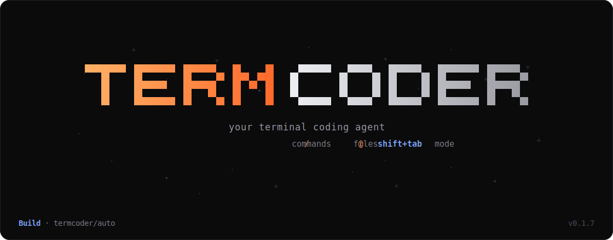

<p align="center">
  
</p>

<h1 align="center">TermCoder</h1>

<p align="center">
  <b>The open-source AI coding agent that lives in your terminal.</b><br/>
  Bring any model — Anthropic, OpenAI, or Gemini — or run it locally with Ollama.<br/>
  A study mode is built in.
</p>

<p align="center">
  <a href="https://www.npmjs.com/package/@termcoder/tui"></a>
  
  
  
</p>

<p align="center">
  <a href="#install">Install</a> ·
  <a href="#quick-start">Quick start</a> ·
  <a href="docs/">Docs</a> ·
  <a href="website/">Website</a> ·
  <a href="docs/termexplorer.md">Study mode</a>
</p>

```sh
npm install -g @termcoder/tui   # then type `term` in any folder
```

---

## Why TermCoder

You describe a task in plain language. TermCoder reads the relevant files, proposes and applies
edits, runs commands, and reports back — asking permission before anything that changes your
machine. It lives entirely in the terminal, and it works with whatever model you have.

| | |
|---|---|
| **Terminal-first** | Slash commands, `@file` mentions, a live model picker, multi-line input, and a trust prompt on first run. Never leaves the keyboard. |
| **Any model, or local** | Anthropic, OpenAI, or Gemini with your key — or a local Ollama model with no account and no data leaving your machine. |
| **Build & Plan modes** | Plan reads and proposes without touching files; Build carries it out. Toggle with `shift+tab`. |
| **A brain that self-reviews** | The default `termcoder/auto` routes each task by difficulty, then reviews its own diff before finishing. |
| **Sub-agents & skills** | Delegate focused work to specialist sub-agents; reusable skill playbooks load on demand. |
| **Kind to your context** | Old tool output is elided and long results are capped, so a long session stops re-billing everything it has read. |
| **A study mode inside** | Switch to `termexplorer` and the same tool becomes a patient tutor for schoolwork — no programming needed. |
| **Extensible** | MCP servers, language servers (LSP), and plugins add tools the agent can call. |

## Install

Requires [Node.js 18+](https://nodejs.org). Install the CLI once — it adds two equivalent
commands, `term` and `termcoder`.

```sh
# Windows (PowerShell or CMD), macOS, or Linux
npm install -g @termcoder/tui
```

Prefer a window? The **desktop app** is a download for Windows, macOS, and Linux — see
[Desktop app](#desktop-app).

## Quick start

```sh
# in any project folder
term

# connect a model once (guided — includes a no-cost option)
❯ /setup

# then just ask
❯ add input validation to the signup form and run the tests
```

The first time in a folder, TermCoder asks whether you trust it. It shows each tool call as it
happens, collapses long output, and prints a diff for every edit before applying it.

## Models & providers

Open the picker with `/model` — it searches a live catalog and groups models into your
favorites, TermCoder's own, cloud providers, and local Ollama models. Connect a key with
`/setup` or `/key`, or set one via environment variable:

| Provider | Environment variable |
|---|---|
| Anthropic | `ANTHROPIC_API_KEY` |
| OpenAI | `OPENAI_API_KEY` |
| Google Gemini | `GEMINI_API_KEY` |

**Run with no key at all** — install [Ollama](https://ollama.com), pull a tool-capable model,
and pick it under *Local*:

```sh
ollama pull qwen2.5-coder
```

```json
{ "model": "ollama/qwen2.5-coder" }
```

> Tool-calling quality varies by model — larger instruct models follow the tool protocol
> better. `qwen2.5-coder`, `llama3.1`, and `mistral-nemo` are good local picks.

## Modes, agents & skills

- **Build / Plan** — `shift+tab` toggles between carrying out changes and read-only planning.
- **Custom agents** — drop a Markdown file with front matter in `.termcoder/agents/` to define
  a role with its own prompt, model, and tool permissions. Switch with `/agent`.
- **Sub-agents** — hand a focused sub-task to a specialist (reviewer, tester, debugger,
  architect) with the `$` key; it works in a nested session and reports back a summary.
- **Skills** — reusable playbooks in `.termcoder/skills/` load only when a task needs them, so
  idle skills cost nothing. List them with `/skills`.

## Study mode — termexplorer

TermCoder ships a sister persona for schoolwork. Pick the `termexplorer/auto` model with
`/model` and it becomes a patient tutor: explanations, summaries, flashcards, practice quizzes,
and study plans — in your language, no programming required. See
[docs/termexplorer.md](docs/termexplorer.md).

## Desktop app

`@termcoder/desktop` is an Electron app that embeds the local server and opens a window with a
React UI — the same engine as the CLI, with tabs, inline diffs, and a simplified study layout.

Download an installer for your system from
[**Releases**](https://github.com/EduardoxDev/TermCoder/releases): Windows (`.exe`),
macOS (`.dmg`), Linux (`.AppImage` / `.deb`). Build it yourself with:

```sh
pnpm --filter @termcoder/desktop package
```

## Extending

**MCP servers** — connect external [MCP](https://modelcontextprotocol.io) servers and expose
their tools alongside the built-ins. Configure in `.termcoder/config.json`:

```json
{
  "mcp": {
    "filesystem": { "type": "stdio", "command": "npx", "args": ["-y", "@modelcontextprotocol/server-filesystem", "."] },
    "remote": { "type": "http", "url": "https://example.com/mcp" }
  }
}
```

**Language servers (LSP)** — configure servers and TermCoder exposes a `diagnostics` tool that
runs the right one for a file's extension and returns errors to the agent.

**Plugins** — a module that default-exports `{ name, register }` can add tools:

```js
import { definePlugin, defineTool } from "@termcoder/core";
import { z } from "zod";

export default definePlugin({
  name: "my-plugin",
  register(api) {
    api.addTool(defineTool({
      name: "now",
      description: "Return the current time",
      inputSchema: z.object({}),
      readOnly: true,
      run: async () => ({ output: new Date().toISOString() }),
    }));
  },
});
```

```json
{ "plugins": ["./my-plugin.mjs", "@me/termcoder-plugin"] }
```

Anything that fails to load (an MCP server, an LSP, a plugin) is reported but never blocks startup.

## Architecture

A pnpm monorepo with a clean split between the engine and the interface:

- **`@termcoder/core`** — the headless agent engine: agent loop, providers (via the
  [Vercel AI SDK](https://sdk.vercel.ai)), tools, permissions, sessions, and config. Emits
  typed events; knows nothing about the terminal.
- **`@termcoder/tui`** — an [Ink](https://github.com/vadimdemedes/ink) (React) terminal client
  that consumes the core's event stream. Ships the `term` / `termcoder` binary.
- **`@termcoder/server`** — an HTTP + WebSocket server wrapping the same core; the foundation
  for the desktop app and future web/IDE clients.
- **`@termcoder/desktop`** — an Electron + React window over the server.

## Documentation

Full guides live in [**docs/**](docs/):

- [SDK](docs/sdk.md) — drive the engine programmatically.
- [Server API](docs/server-api.md) — the HTTP + WebSocket reference.
- [Configuration](docs/configuration.md) — every config key.
- [Study mode](docs/termexplorer.md) — the termexplorer guide, for students.
- [GitHub Action](docs/github-action.md) — run TermCoder in CI.

## Development

```sh
pnpm install
pnpm build
pnpm test

pnpm dev                                   # run the TUI (needs a model key or Ollama)
pnpm --filter @termcoder/server dev        # or the headless server (PORT=4096)
pnpm --filter @termcoder/desktop dev       # or the desktop app
```

## License

MIT
