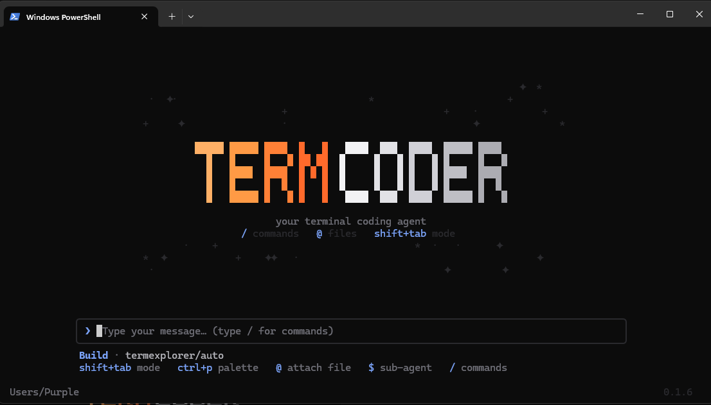

<h1 align="center">TermCoder</h1>

<p align="center">
  <b>The open-source AI coding agent that lives in your terminal — and a tutor that teaches you.</b><br/>
  Runs with <b>no API key</b>. Bring one of twelve providers when you want it, or stay local with Ollama.<br/>
  One engine, two minds.
</p>

<p align="center">
  
</p>

<p align="center">
  <a href="https://www.npmjs.com/package/@termcoder/tui"></a>
  
  
  
</p>

<p align="center">
  <a href="#install">Install</a> ·
  <a href="#quick-start">Quick start</a> ·
  <a href="docs/">Docs</a> ·
  <a href="website/">Website</a> ·
  <a href="docs/termexplorer.md">Study mode</a>
</p>

```sh
npm install -g @termcoder/tui   # then type `term` in any folder
```

---

## Why TermCoder

You describe a task in plain language. TermCoder reads the relevant files, proposes and applies
edits, runs commands, and reports back — asking permission before anything that changes your
machine. It lives entirely in the terminal, and it starts working before you have configured
anything.

| | |
|---|---|
| **No API key** | It opens on a free, keyless model. No card, no sign-up, no config file. Connect a provider later, or never. |
| **Any model, or local** | Twelve providers behind one path — or a local Ollama model, with no account and nothing leaving your machine. |
| **The right model per turn** | `termcoder/auto` classifies each prompt and routes it to a fast or a strong tier. No LLM in the routing loop — a regex and a table. |
| **It remembers** | Durable notes in `.termcoder/memory` — shared with your team through git, or kept private. Only names enter the prompt; bodies load on demand. |
| **It finds the file** | Lexical retrieval injects file and symbol *pointers*, not file bodies. No embeddings, no index server. |
| **Autonomous mode** | Hand it a goal and a verify command; it works, runs the check, reads the failure, and loops until it passes. Every round is checkpointed. |
| **Build & Plan modes** | Plan reads and proposes without touching files; Build carries it out. Toggle with `shift+tab`. |
| **Sub-agents & skills** | Delegate focused work to specialist sub-agents; reusable skill playbooks load only when a task needs them. |
| **A tutor inside** | Switch to `termexplorer` and the same tool becomes a patient tutor — flashcards with real SM-2 spaced repetition, quizzes, a streak. |
| **Study together** | Live rooms with voice, camera and screen share, peer-to-peer. Classrooms ride on a private gist — nothing to host. |
| **Extensible** | MCP servers (with a one-click connector catalogue), language servers, and plugins add tools the agent can call. |

## Install

Requires [Node.js 18+](https://nodejs.org). Install the CLI once — it adds two equivalent
commands, `term` and `termcoder`.

```sh
# Windows (PowerShell or CMD), macOS, or Linux
npm install -g @termcoder/tui
```

Prefer a window? The **desktop app** is a download for Windows, macOS, and Linux — see
[Desktop app](#desktop-app).

## Quick start

```sh
# in any project folder
term

# just ask — there is nothing to configure first
❯ add input validation to the signup form and run the tests
```

It opens on a free, keyless model, so that is the whole quick start. The first time in a folder,
TermCoder asks whether you trust it. It shows each tool call as it happens, collapses long
output, and prints a diff for every edit before applying it.

Want better answers? Connect a provider whenever you like — `/setup` walks you through a free
Gemini key, `/key <provider> <key>` sets one directly, and `/login-claude` signs in with a
Claude Pro/Max subscription instead of paying per token.

## Models & providers

Open the picker with `/model` — it searches a live catalog and groups models into your
favorites, TermCoder's own, cloud providers, and local Ollama models. `●` means the key was
probed with a real request and works; `○` means it still needs one.

**Out of the box** it runs `termcoderfree/auto` — a community-hosted model that needs no key at
all. It is rate-limited when busy, and prompts go to a third party we do not run, so point it at
Ollama when you want privacy, or connect a provider when you want quality.

Twelve providers are supported behind one OpenAI-compatible path — Anthropic, OpenAI, Google,
Groq, OpenRouter, Mistral, DeepSeek, xAI, Together, Cerebras, Ollama and Pollinations. Connect a
key with `/setup` or `/key`, or set one via environment variable:

| Provider | Environment variable |
|---|---|
| Anthropic | `ANTHROPIC_API_KEY` |
| OpenAI | `OPENAI_API_KEY` |
| Google Gemini | `GEMINI_API_KEY` |

Or sign in with a subscription instead of a key: `/login-claude` (Claude Pro/Max) and
`/login-chatgpt` (ChatGPT Plus/Pro). Both are **experimental** — they reuse the vendors' own
client credentials the way their official CLIs do, which is a grey area in their terms, so both
fail gracefully back to the keyless model.

**Fully local and private** — install [Ollama](https://ollama.com), pull a tool-capable model,
and pick it under *Local*:

```sh
ollama pull qwen2.5-coder
```

```json
{ "model": "ollama/qwen2.5-coder" }
```

> Tool-calling quality varies by model — larger instruct models follow the tool protocol
> better. `qwen2.5-coder`, `llama3.1`, and `mistral-nemo` are good local picks.

## Modes, agents & skills

- **Build / Plan** — `shift+tab` toggles between carrying out changes and read-only planning.
- **Custom agents** — drop a Markdown file with front matter in `.termcoder/agents/` to define
  a role with its own prompt, model, and tool permissions. Switch with `/agent`.
- **Sub-agents** — hand a focused sub-task to a specialist (reviewer, tester, debugger,
  architect) with the `$` key; it works in a nested session and reports back a summary.
- **Skills** — reusable playbooks in `.termcoder/skills/` load only when a task needs them, so
  idle skills cost nothing. List them with `/skills`.

## Memory & retrieval

Tell it something once and it keeps it. Memory lives as markdown in `.termcoder/memory` (shared
with your team through git) plus a private user store — only names and one-line descriptions sit
in the prompt, and a body loads when the agent reaches for it. A guard refuses to store anything
that looks like a credential.

```
❯ /remember  the auth module is fragile — tread carefully
❯ /memories                       # list them    ❯ /forget <name>
```

Retrieval ranks your files lexically and injects **pointers** — paths and symbol locations, not
file bodies — so it stops re-reading the repo to find where a thing lives. No embeddings, no
index server, no new dependency.

```
❯ symbols resolveModel       →  provider.ts:98
```

## Autonomous mode

Hand it a goal and a way to check the work. It edits, runs the command, reads the failure, and
goes again until the command exits zero — or it hits the round cap.

```sh
❯ /background make the build green
round 1  edit → npm run build   ✗ 2 type errors
round 2  fix types → build      ✗ 1 test failing
round 3  fix test → build       ✓ passed
```

Permissions are auto-approved while it runs, so every round is checkpointed — `/revert` walks
any of it back.

## Study mode — termexplorer

TermCoder ships a sister persona for schoolwork. Pick the `termexplorer/auto` model with
`/model` and the same tool becomes a patient tutor — explanations step by step, summaries,
practice quizzes and study plans, in your language, with no programming required.

Flashcards use a real **SM-2** spaced-repetition scheduler, so cards come back when you are
about to forget them, and a streak counts consecutive days. It all stays on your machine.

```
❯ /flashcards binary search    # generate a deck from any topic
❯ /review                      # front → reveal → grade 0–5
❯ /decks                       # what is due, and the streak
```

See [docs/termexplorer.md](docs/termexplorer.md).

## Live rooms & classrooms

**Live rooms** — share your session with a link. Voice, camera, screen share and chat run
peer-to-peer over STUN; no media server sits in the middle. Any participant can answer a
permission prompt, and the first decision wins.

**Classrooms** — a class is a private gist: the teacher shares packs of agents and skills, sets
assignments and grades submissions; joins, submissions and the roster ride on gist comments. It
works asynchronously, with nothing to host.

```
❯ /class create "Algoritmos 2"    ❯ /class submit a1    ❯ /class grade
```

Joining any room or class is free forever. Hosting a room for more than one person, or running a
classroom, needs a licence — the host pays, the guests never do.

## Desktop app

`@termcoder/desktop` is an Electron app that embeds the local server and opens a window with a
React UI — the same engine as the CLI. Chat, an editor and a **real shell** live in one window:
the `Chat | Terminal` tabs (`Ctrl`+`` ` ``) run your default shell in the project folder and drop
a one-click chip on every coding CLI found on your `PATH` — Claude Code, Codex, Gemini CLI. The
shell keeps running while you are on the Chat tab.

Download an installer for your system from
[**Releases**](https://github.com/Cartivo-Oficial/TermCoder/releases): Windows (`.exe`),
macOS (`.dmg`), Linux (`.AppImage` / `.deb`). Build it yourself with:

```sh
pnpm --filter @termcoder/desktop package
```

## Extending

**MCP servers** — connect external [MCP](https://modelcontextprotocol.io) servers and expose
their tools alongside the built-ins. Configure in `.termcoder/config.json`:

```json
{
  "mcp": {
    "filesystem": { "type": "stdio", "command": "npx", "args": ["-y", "@modelcontextprotocol/server-filesystem", "."] },
    "remote": { "type": "http", "url": "https://example.com/mcp" }
  }
}
```

**Language servers (LSP)** — configure servers and TermCoder exposes a `diagnostics` tool that
runs the right one for a file's extension and returns errors to the agent.

**Plugins** — a module that default-exports `{ name, register }` can add tools:

```js
import { definePlugin, defineTool } from "@termcoder/core";
import { z } from "zod";

export default definePlugin({
  name: "my-plugin",
  register(api) {
    api.addTool(defineTool({
      name: "now",
      description: "Return the current time",
      inputSchema: z.object({}),
      readOnly: true,
      run: async () => ({ output: new Date().toISOString() }),
    }));
  },
});
```

```json
{ "plugins": ["./my-plugin.mjs", "@me/termcoder-plugin"] }
```

Anything that fails to load (an MCP server, an LSP, a plugin) is reported but never blocks startup.

## Architecture

A pnpm monorepo with a clean split between the engine and the interface:

- **`@termcoder/core`** — the headless agent engine: agent loop, providers (via the
  [Vercel AI SDK](https://sdk.vercel.ai)), tools, permissions, sessions, and config. Emits
  typed events; knows nothing about the terminal.
- **`@termcoder/tui`** — an [Ink](https://github.com/vadimdemedes/ink) (React) terminal client
  that consumes the core's event stream. Ships the `term` / `termcoder` binary.
- **`@termcoder/server`** — an HTTP + WebSocket server wrapping the same core; the foundation
  for the desktop app and future web/IDE clients.
- **`@termcoder/desktop`** — an Electron + React window over the server.

## Documentation

Full guides live in [**docs/**](docs/):

- [SDK](docs/sdk.md) — drive the engine programmatically.
- [Server API](docs/server-api.md) — the HTTP + WebSocket reference.
- [Configuration](docs/configuration.md) — every config key.
- [Study mode](docs/termexplorer.md) — the termexplorer guide, for students.
- [GitHub Action](docs/github-action.md) — run TermCoder in CI.

## Development

```sh
pnpm install
pnpm build
pnpm test

pnpm dev                                   # run the TUI (no key needed — opens on the free model)
pnpm --filter @termcoder/server dev        # or the headless server (PORT=4096)
pnpm --filter @termcoder/desktop dev       # or the desktop app
```

## License

MIT
